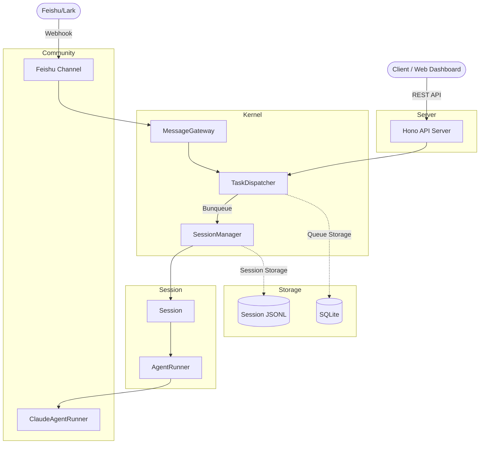

# 📯 Agentara

[](https://github.com/MagicCube/agentara/actions/workflows/ci.yml)
[](https://github.com/MagicCube/agentara/actions/workflows/test.yml)
[](LICENSE)
[](https://bun.sh)
[](https://www.typescriptlang.org)
[](https://hono.dev)
[](https://react.dev)

A 24/7 personal assistant powered by Claude Code as a SuperAgent. Multi-channel messaging, task scheduling, session management, and more — all running locally.

You can call me **Tara** for short.

## Features

- **Agent-powered sessions** — Interact with Claude Code through managed sessions with full streaming support
- **Multi-channel messaging** — Receive and respond to messages from multiple channels (e.g. Feishu/Lark)
- **Task scheduling** — Queue-based task dispatcher with per-session serial execution and cross-session concurrency
- **Cron jobs** — Schedule recurring tasks with cron patterns
- **Session persistence** — Sessions stored as JSONL files with full message history
- **Web dashboard** — React-based UI for managing sessions, tasks, and memory
- **File and image support** — Send and receive files and images through message channels
- **RESTful API** — Hono-based API server with type-safe RPC client

## Tech Stack

**Backend**

| Category | Technology |
|----------|------------|
| Runtime | [Bun](https://bun.sh) |
| Language | TypeScript |
| API | [Hono](https://hono.dev) |
| Database | SQLite (Bun built-in) + [Drizzle ORM](https://orm.drizzle.team) |
| Task Queue | [Bunqueue](https://github.com/nicexlab/bunqueue) |
| Validation | [Zod](https://zod.dev) |
| Logging | [Pino](https://getpino.io) |
| Date | [Day.js](https://day.js.org) |
| Events | [EventEmitter3](https://github.com/primus/eventemitter3) |

**Frontend**

| Category | Technology |
|----------|------------|
| Framework | React 19 + Vite 7 |
| Routing | TanStack Router |
| Data Fetching | TanStack React Query |
| Styling | Tailwind CSS v4 + [Shadcn](https://ui.shadcn.com) |
| Theme | Dark mode by default |

## Prerequisites

- [Bun](https://bun.sh) (latest)
- [Claude Code](https://docs.anthropic.com/en/docs/claude-code) installed and configured

## Quick Start

```bash
# Clone the repository
git clone https://github.com/anthropics/agentara.git
cd agentara

# Install dependencies
bun install

# Start both backend and frontend in dev mode
bun run dev
```

On first run, Agentara creates `~/.agentara` with default config, workspace, and data directories.

The backend runs on `http://localhost:1984` and the frontend dev server on `http://localhost:8000` (proxying API requests to the backend).

## Configuration

### Environment Variables

| Variable | Description | Default |
|----------|-------------|---------|
| `AGENTARA_HOME` | Home directory for all Agentara data | `~/.agentara` |
| `AGENTARA_LOG_LEVEL` | Log level (`trace`, `debug`, `info`, `warn`, `error`) | `info` |
| `AGENTARA_SERVICE_PORT` | API server port | `1984` |
| `AGENTARA_SERVICE_HOST` | API server host | `localhost` |

### Config File

A `config.yaml` is auto-generated at `$AGENTARA_HOME/config.yaml` on first run. Key fields:

| Field | Description | Default |
|-------|-------------|---------|
| `default_agent` | Agent runner to use | `claude-code` |
| `agent_model` | Model for the agent | `claude-sonnet-4-6` |

### Directory Structure

All data lives under `$AGENTARA_HOME` (`~/.agentara` by default):

```
~/.agentara/
├── config.yaml       # Configuration file
├── workspace/        # Agent workspace
├── sessions/         # Session JSONL files
├── memory/           # Agent memory
└── data/             # SQLite databases
```

## Architecture Overview



## Project Structure

```
src/
├── shared/           # Cross-layer types, utilities, conventions
│   ├── agents/       # AgentRunner interface
│   ├── messaging/    # Message types, channels, gateway
│   ├── tasking/      # Task payload types
│   ├── sessioning/   # Session types
│   ├── config/       # Paths and configuration
│   ├── logging/      # Pino logger
│   └── utils/        # Pure utilities
├── kernel/           # Core orchestration
│   ├── agents/       # Agent runner factory
│   ├── sessioning/   # Session, SessionManager
│   ├── tasking/      # TaskDispatcher (Bunqueue)
│   └── messaging/    # Multi-channel message gateway
├── community/        # Provider implementations
│   ├── anthropic/    # Claude agent runner
│   └── feishu/       # Feishu/Lark messaging channel
├── server/           # Hono API server
├── data/             # Database connection
└── boot-loader/      # Bootstrap and integrity verification
web/                  # React frontend (separate package)
```

## Scripts

| Command | Description |
|---------|-------------|
| `bun run dev` | Start backend and frontend in dev mode |
| `bun run dev:server` | Start backend only |
| `bun run dev:web` | Start frontend only |
| `bun run check` | Type-check and lint |
| `bun run build:bin` | Compile to a standalone binary |
| `bun run build:js` | Build JS bundle |

## Contributing

Contributions are welcome! Here's how to get started:

1. **Fork** the repository
2. **Create a branch** for your feature or fix: `git checkout -b feat/my-feature`
3. **Install dependencies**: `bun install`
4. **Make your changes** and ensure they pass checks:
   ```bash
   bun run check    # Type-check + lint
   ```
5. **Commit** with a clear message following [Conventional Commits](https://www.conventionalcommits.org):
   - `feat:` for new features
   - `fix:` for bug fixes
   - `chore:` for maintenance
   - `docs:` for documentation
6. **Open a Pull Request** against `main`

### Code Conventions

- Use `logger` from `@/shared` for logging — never use `console.log` directly
- Import from `@/shared` directly, not from sub-paths
- Entities are defined with Zod schemas first, TypeScript interfaces second
- Use underscore naming for entity fields
- Private class members are prefixed with `_`
- Provide TSDoc for all public APIs

## License

[MIT](LICENSE)
